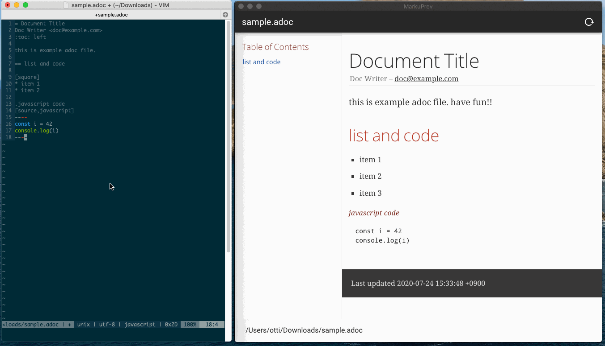
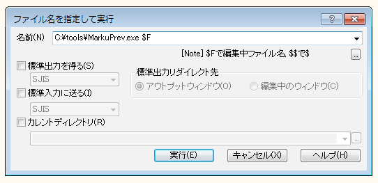

# MarkuPrev

MarkdownやAsciidocなどの軽量マークアップ言語のプレビューアです．
ファイルを監視して，自動ビルドしてくれるので，好きなエディタを使ってファイルを編集できます．



## 対応

* プラットフォーム
    * macOS (x64, Apple Silicon)
    * Windows (x64)
    * Linux (x64)
* ファイルタイプ
    * .adoc
    * .md

## インストール

[Releaseページ](https://github.com/ottijp/markuprev/releases)から，各プラットフォーム向けのアプリをダウンロードしてください．

## 使い方

* アプリを起動し，プレビューするファイルをドロップもしくはダイアログで開きます
* アプリがファイルの変更を検知し，自動でビルドされ，プレビューが更新されます

## エディタとの連携

実行時にファイルを指定して起動できるので，編集中のファイルをエディタから連携起動できるようにしておくと便利です．

### vim

```vim
" for mac
function! OpenWithMarkuPrev()
  call system('open /Applications/MarkuPrev.app' . ' -n --args ' . shellescape(expand('%:p')))
endfunction
command! MarkuPrev call OpenWithMarkuPrev()

" for windows
function! OpenWithMarkuPrev()
  call system('path/to/MarkuPrev.exe' . ' ' . shellescape(expand('%:p')))
endfunction
command! MarkuPrev call OpenWithMarkuPrev()

" for linux
function! OpenWithMarkuPrev()
  call system('nohup path/to/MarkuPrev.appImage' . ' ' . shellescape(expand('%:p')) . ' &')
endfunction
command! MarkuPrev call OpenWithMarkuPrev()
```

### emacs

（emacsは使っていないので設定方法がわかりません．わかる方書いてくれると助かります．）

### サクラエディタ

「ファイル名を指定して実行」機能で，次のように起動します．

```
path\to\MarkuPrev.exe $F
```



## Dev

### Project setup

```sh
yarn install
```

### Compiles and hot-reloads for development

```sh
yarn dev
```

### Compiles and minifies for production

```sh
yarn electron:build:win
yarn electron:build:linux
export APPLE_ID="YOURS"
export APPLE_APP_SPECIFIC_PASSWORD="YOURS"
export APPLE_TEAM_ID="YOURS"
op run --env-file=.env -- yarn electron:build:mac
```

### Lints and fixes files

```sh
yarn lint
```

### delete artifacts

```sh
yarn clean
```
